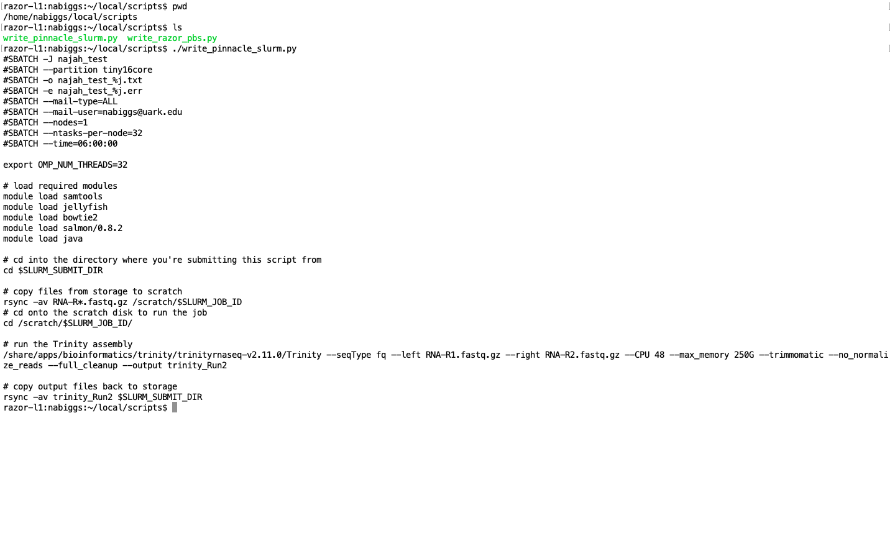

# BIOL5153
Formatted CV

assn03.tgz: zipped tape archive of batch scripts and output files from BIOL 5153 Assignment 3

assn04.py python scripts 

Homework #5:added nucleotide_composition.py which reads DNA sequence from dna.txt and prints sequence length and nucleotide freq to the screen
